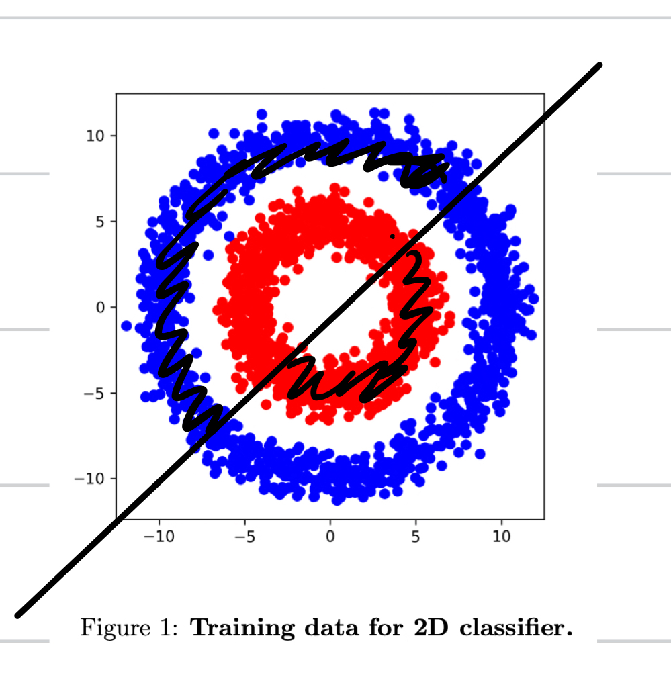
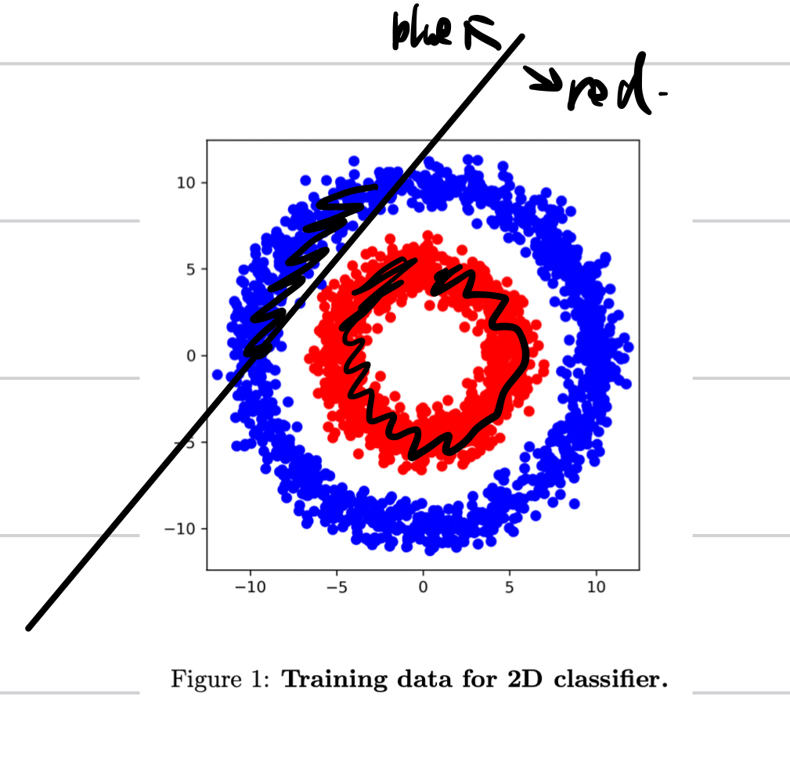
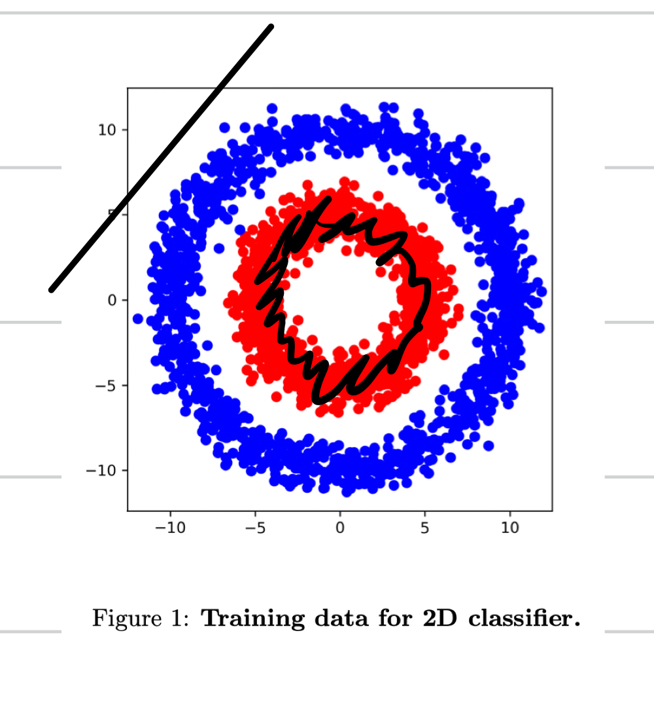
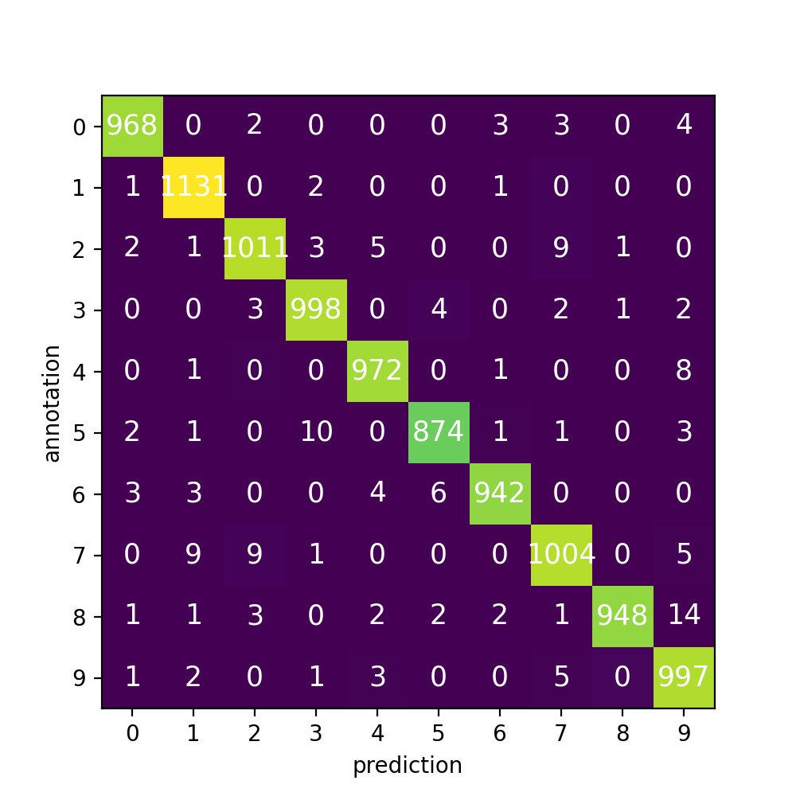
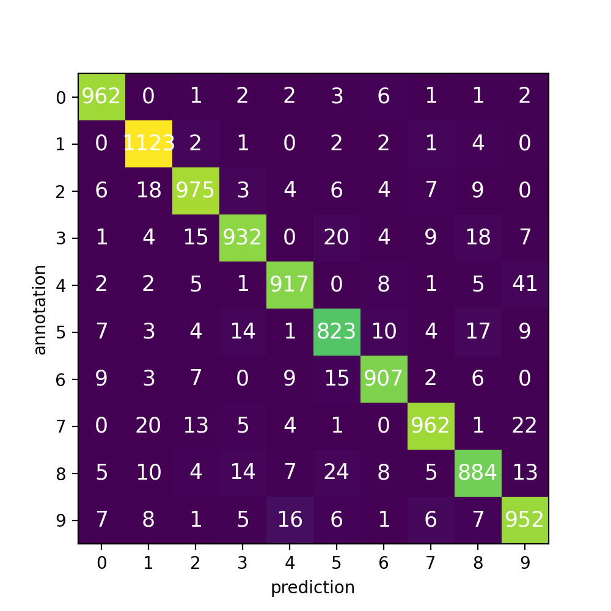

# Computer Vision Assignment 01: Introduction to PyTorch Report

[TOC]

## 2 Simple 2D Classifier

### 2.3 Training loop

**Question**: Once this is done, you should be able to run the `train.py` script. What accuracy do you achieve with the linear classifier? Is this an expected result? Justify your answer.

```shell
>>> python train.py
[Epoch 01] Acc.: 43.0556%
[Epoch 02] Loss: 0.7339
[Epoch 02] Acc.: 40.6746%
[Epoch 03] Loss: 0.7000
[Epoch 03] Acc.: 49.8016%
[Epoch 04] Loss: 0.6960
[Epoch 04] Acc.: 32.9365%
[Epoch 05] Loss: 0.6942
[Epoch 05] Acc.: 40.6746%
[Epoch 06] Loss: 0.6934
[Epoch 06] Acc.: 41.8651%
[Epoch 07] Loss: 0.6933
[Epoch 07] Acc.: 44.6429%
[Epoch 08] Loss: 0.6933
[Epoch 08] Acc.: 47.0238%
[Epoch 09] Loss: 0.6932
[Epoch 09] Acc.: 46.6270%
[Epoch 10] Loss: 0.6933
[Epoch 10] Acc.: 48.6111%
```

* The accuracy is `48.6111%` which is lower than expected (`50%` for random guess). However, the data shown below is not linearly separable.

* If we analyze the distribution of the data, we can find that there are three cases (we assume the sizes of two classes are the same): 

  * the decision boundary go through the center of circle => accuracy equals to 50%

    

  * the decision boundary have intersection with circle, but does not go through the center => accuracy larger than 50%

    

  * the decision boundary does not have intersection with circle => accuracy equals to 50%

    

  * Therefore, the accuracy should be larger than 50%, but the result accuracy is less than 50%, which is **not expected**. This implies that the linear model is not well converged (may be land in some local minimum) when the dataset is not linearly separable.

### 2.4 Multi-layer perceptron

**Question**: Switch to the new network by uncommenting `L83` in `train.py`. What accuracy does this network obtain? Why are the results better compared to the previous classifier?

```shell
>>> python train.py
[Epoch 01] Loss: 0.6409
[Epoch 01] Acc.: 51.3889%
[Epoch 02] Loss: 0.5039
[Epoch 02] Acc.: 95.2381%
[Epoch 03] Loss: 0.2507
[Epoch 03] Acc.: 99.4048%
[Epoch 04] Loss: 0.0961
[Epoch 04] Acc.: 99.6032%
[Epoch 05] Loss: 0.0484
[Epoch 05] Acc.: 99.6032%
[Epoch 06] Loss: 0.0299
[Epoch 06] Acc.: 99.6032%
[Epoch 07] Loss: 0.0210
[Epoch 07] Acc.: 99.6032%
[Epoch 08] Loss: 0.0160
[Epoch 08] Acc.: 99.6032%
[Epoch 09] Loss: 0.0128
[Epoch 09] Acc.: 99.8016%
[Epoch 10] Loss: 0.0111
[Epoch 10] Acc.: 99.8016%
```

* The final accuracy is `99.8016%`, which is better than the linear classifier. 
* The hidden layers and activation functions introduce non-linearity into the model. According to the Universal Approximation Theorem, any continuous function $C(I_n)$ on the n-dimensional unit cube $I_n$ can be approximated by a MLP with a hidden layer (with enough number of neurons). That means the front layers of MLP will automatically transform the coordinate to make the data linearly separable for the last layer. Therefore, this structure improves the performance.

### 2.5 Feature transform

**Question**: Think of a coordinate system that renders the two classes linearly separable and justify your choice.


* By observation, the data is not linearly separable since it is a circle. However, by changing the coordinate system to polar system or simply use $(x,y)\mapsto({x^2}, {y^2})$. Then the data will distribute on two lines:
  $$
  x^2+y^2 = r_1 \\
  x^2+y^2 = r_2
  $$
  Therefore, the classes become linearly separable.

**Question**: Verify the hypothesis by training a linear classifier on the new representation.

```shell
>>> python train.py
[Epoch 01] Loss: 0.7104
[Epoch 01] Acc.: 50.0000%
[Epoch 02] Loss: 0.6177
[Epoch 02] Acc.: 50.0000%
[Epoch 03] Loss: 0.5581
[Epoch 03] Acc.: 50.1984%
[Epoch 04] Loss: 0.5060
[Epoch 04] Acc.: 53.3730%
[Epoch 05] Loss: 0.4578
[Epoch 05] Acc.: 71.4286%
[Epoch 06] Loss: 0.4140
[Epoch 06] Acc.: 76.9841%
[Epoch 07] Loss: 0.3766
[Epoch 07] Acc.: 91.0714%
[Epoch 08] Loss: 0.3412
[Epoch 08] Acc.: 93.6508%
[Epoch 09] Loss: 0.3106
[Epoch 09] Acc.: 97.8175%
[Epoch 10] Loss: 0.2824
[Epoch 10] Acc.: 99.6032%
```

* Although it does not converge as fast as the MLP model, the accuracy is significantly improved.

## 3 Digit classifier

### 3.3 Multi-layer perceptron

**Question**: Implement a linear classifier by filling in the `MLPClassifier ` class from `lib/networks.py`. What performance do you obtain? `91.2600%`

```python
self.layers = nn.Sequential(
		 nn.Linear(784, 10)
)
```

```shell
>>> python train.py
100%|██████████████████████████████████████| 3750/3750 [00:30<00:00, 122.82it/s]
[Epoch 01] Loss: 0.4088
[Epoch 01] Acc.: 90.8600%
100%|██████████████████████████████████████| 3750/3750 [00:30<00:00, 121.56it/s]
[Epoch 02] Loss: 0.3350
[Epoch 02] Acc.: 89.1800%
100%|██████████████████████████████████████| 3750/3750 [00:30<00:00, 121.43it/s]
[Epoch 03] Loss: 0.3208
[Epoch 03] Acc.: 90.8300%
100%|██████████████████████████████████████| 3750/3750 [00:33<00:00, 112.44it/s]
[Epoch 04] Loss: 0.3146
[Epoch 04] Acc.: 91.8800%
100%|██████████████████████████████████████| 3750/3750 [00:32<00:00, 113.81it/s]
[Epoch 05] Loss: 0.3092
[Epoch 05] Acc.: 91.2600%
```

**Question**: Next, use an MLP with one hidden layer of dimension 32 followed by ReLU and then the final linear prediction layer. What is the new testing accuracy?`93.6400%`

```python
self.layers = nn.Sequential(
	  nn.Linear(784, 32),
    nn.ReLU(),
    nn.Linear(32,10)
)
```

```shell
>>> python train.py
100%|██████████████████████████████████████| 3750/3750 [00:32<00:00, 114.94it/s]
[Epoch 01] Loss: 0.4166
[Epoch 01] Acc.: 91.4300%
100%|██████████████████████████████████████| 3750/3750 [00:32<00:00, 117.09it/s]
[Epoch 02] Loss: 0.2859
[Epoch 02] Acc.: 92.6200%
100%|██████████████████████████████████████| 3750/3750 [00:33<00:00, 113.34it/s]
[Epoch 03] Loss: 0.2429
[Epoch 03] Acc.: 93.5000%
100%|██████████████████████████████████████| 3750/3750 [00:31<00:00, 117.46it/s]
[Epoch 04] Loss: 0.2165
[Epoch 04] Acc.: 94.3700%
100%|██████████████████████████████████████| 3750/3750 [00:32<00:00, 115.52it/s]
[Epoch 05] Loss: 0.1986
[Epoch 05] Acc.: 93.6400%
```

### 3.4 Convolutional network

**Question**: What testing accuracy do you obtain with this architecture? `98.4500%`

```shell
100%|███████████████████████████████████████| 3750/3750 [00:42<00:00, 88.20it/s]
[Epoch 01] Loss: 0.2677
[Epoch 01] Acc.: 97.3400%
100%|███████████████████████████████████████| 3750/3750 [00:41<00:00, 89.81it/s]
[Epoch 02] Loss: 0.0810
[Epoch 02] Acc.: 97.7400%
100%|███████████████████████████████████████| 3750/3750 [00:49<00:00, 76.11it/s]
[Epoch 03] Loss: 0.0614
[Epoch 03] Acc.: 98.4200%
100%|███████████████████████████████████████| 3750/3750 [00:41<00:00, 89.31it/s]
[Epoch 04] Loss: 0.0495
[Epoch 04] Acc.: 98.3700%
100%|███████████████████████████████████████| 3750/3750 [00:41<00:00, 89.70it/s]
[Epoch 05] Loss: 0.0440
[Epoch 05] Acc.: 98.4500%
```

### 3.5 Comparison of number of parameters

**Question**: Compute the number of parameters of the MLP with one hidden layer. Compute the number of parameters of the convolutional network. **You should count both the weights and biases**. Provide detailed explanations and computations.

* MLP: For each layer, number of weight is the number of input dimension times the number of output dimension, number of bias is the output dimension, therefore:
  $$
  Parameter\_Num=\sum^{layers}_{i}(in\_channel_i+1)(out\_channel_i)\\
  $$

* Convolution: For each layer, number of weight equals to the number of kernel times the number of weight in each kernel. Number of bias is the output channel number:
  $$
  Parameter\_Num = \sum^{layers}_{i}(in\_channel_i\times width_i\times height_i+1)(out\_channel_i)
  $$

* The result is shown as below:

$$
Parameter\_Num_{MLP} = (784 + 1)\times32 + (32 + 1) \times 10=25450\\
Parameter\_Num_{convolution} = 8\times(1+3\times3\times1)  + 16\times(1+3\times3\times8) \\+ 32\times(1+3\times3\times16) + (32+1)\times10 = 6218
$$

### 3.6 Confusion matrix

**Question**: The confusion matrix $M_{i,j}$ is a useful tool for understanding the performance of a classifier. It is defined as follows: $M_{i,j}$ is the number of test samples for which the network predicted $i$, but the ground-truth label was $j$. Ideally, in the case of `100%` accuracy, this will be a diagonal matrix. Based on the run validation epoch function from `train.py`, update `plot_confusion_matrix.py` to compute the confusion matrix. Provide the plot in the report and comment the results.

* **Confusion matrix for CNN (left)**: The summation of the matrix equals to the size of the dataset. The performance of the model is good because the matrix is very closed to a diagonal matrix. 

  

* **Confusion matrix for MLP (right)**: The summation of the matrix equals to the size of the dataset. But the values are more dense than the CNN result. Therefore the performance is not as good as CNN model.

  

. 