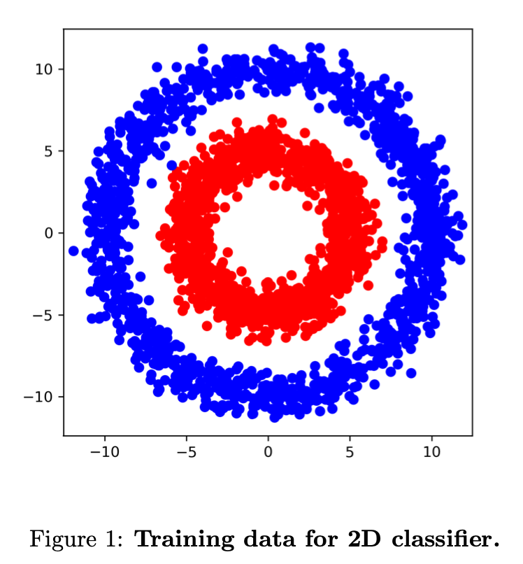

# Computer Vision Assignment 01: Introduction to PyTorch Report

[TOC]

## 2 Simple 2D Classifier

### 2.3 Training loop

**Question**: Once this is done, you should be able to run the `train.py` script. What accuracy do you achieve with the linear classifier? Is this an expected result? Justify your answer.

```shell
>>> python train.py
[Epoch 01] Acc.: 43.0556%
[Epoch 02] Loss: 0.7339
[Epoch 02] Acc.: 40.6746%
[Epoch 03] Loss: 0.7000
[Epoch 03] Acc.: 49.8016%
[Epoch 04] Loss: 0.6960
[Epoch 04] Acc.: 32.9365%
[Epoch 05] Loss: 0.6942
[Epoch 05] Acc.: 40.6746%
[Epoch 06] Loss: 0.6934
[Epoch 06] Acc.: 41.8651%
[Epoch 07] Loss: 0.6933
[Epoch 07] Acc.: 44.6429%
[Epoch 08] Loss: 0.6933
[Epoch 08] Acc.: 47.0238%
[Epoch 09] Loss: 0.6932
[Epoch 09] Acc.: 46.6270%
[Epoch 10] Loss: 0.6933
[Epoch 10] Acc.: 48.6111%
```

* The accuracy is `48.6111%` which is lower than expected (`50%` for random guess). However, the data shown below is not linearly separable, so the accuracy closed to `50%` becomes reasonable.

### 2.4 Multi-layer perceptron

**Question**: Switch to the new network by uncommenting `L83` in `train.py`. What accuracy does this network obtain? Why are the results better compared to the previous classifier?

```shell
>>> python train.py
[Epoch 01] Loss: 0.6409
[Epoch 01] Acc.: 51.3889%
[Epoch 02] Loss: 0.5039
[Epoch 02] Acc.: 95.2381%
[Epoch 03] Loss: 0.2507
[Epoch 03] Acc.: 99.4048%
[Epoch 04] Loss: 0.0961
[Epoch 04] Acc.: 99.6032%
[Epoch 05] Loss: 0.0484
[Epoch 05] Acc.: 99.6032%
[Epoch 06] Loss: 0.0299
[Epoch 06] Acc.: 99.6032%
[Epoch 07] Loss: 0.0210
[Epoch 07] Acc.: 99.6032%
[Epoch 08] Loss: 0.0160
[Epoch 08] Acc.: 99.6032%
[Epoch 09] Loss: 0.0128
[Epoch 09] Acc.: 99.8016%
[Epoch 10] Loss: 0.0111
[Epoch 10] Acc.: 99.8016%
```

* The final accuracy is `99.8016%`, which is better than the linear classifier. 

### 2.5 Feature transform

**Question**: Think of a coordinate system that renders the two classes linearly separable and justify your choice.



* By observation, the data is not linearly separable since it is a circle. However, by changing the coordinate system to polar system or simply use $(x,y)\mapsto({x^2}, {y^2})$. Then the data will distribute on two lines:
  $$
  x^2+y^2 = r_1 \\
  x^2+y^2 = r_2
  $$
  Therefore, the classes become linearly separable.

**Question**: Verify the hypothesis by training a linear classifier on the new representation.

```shell
>>> python train.py
[Epoch 01] Loss: 0.7104
[Epoch 01] Acc.: 50.0000%
[Epoch 02] Loss: 0.6177
[Epoch 02] Acc.: 50.0000%
[Epoch 03] Loss: 0.5581
[Epoch 03] Acc.: 50.1984%
[Epoch 04] Loss: 0.5060
[Epoch 04] Acc.: 53.3730%
[Epoch 05] Loss: 0.4578
[Epoch 05] Acc.: 71.4286%
[Epoch 06] Loss: 0.4140
[Epoch 06] Acc.: 76.9841%
[Epoch 07] Loss: 0.3766
[Epoch 07] Acc.: 91.0714%
[Epoch 08] Loss: 0.3412
[Epoch 08] Acc.: 93.6508%
[Epoch 09] Loss: 0.3106
[Epoch 09] Acc.: 97.8175%
[Epoch 10] Loss: 0.2824
[Epoch 10] Acc.: 99.6032%
```

* Although it does not converge as fast as the MLP model, the accuracy is significantly improved.

## 3 Digit classifier

