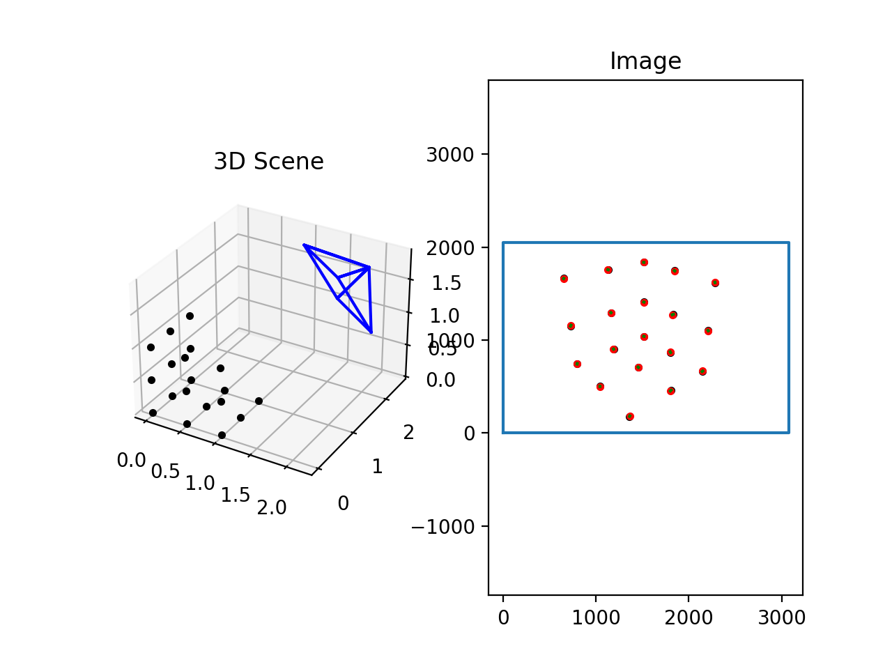

# Computer Vision Assignment 03: Camera calibration and Structure from Motion Report

## 2.2 Calibration

### (a) Data Normalization

Explanation: The data is normalized by adding mean and dividing variance, which moves center of mass to origin and scale to yield order 1 values. This step is achieved by multiplying a transform matrix $T$. 
$$
Normalize:\ \hat{x} = T_{2D} x ,\ \hat{X} = T_{3D} X\\
$$

$$
\ T_{2D} = \begin{bmatrix}
\sigma_{2D} & 0 & \bar{x}\\
0 & \sigma_{2D} & \bar{y}\\
0 & 0 & 1
\end{bmatrix} , 
T_{3D} = \begin{bmatrix}
\sigma_{3D} & 0  & 0& \bar{X}\\
0 & \sigma_{3D} & 0 & \bar{Y}\\
0 & 0 & \sigma_{3D} & \bar{Z} \\
0 & 0 & 0 & 1
\end{bmatrix}
$$

Question: **Potential problems if we skip this step**

The data may contain very large or small values, which will affect the constraint matrix and increase the error when we do SVD to the constraint matrix.

### (b) Direct Linear Transform (DLT)

Explanation: Since the vector $x$ (point in image) and the image of vector $X$ (point in the 3D world) should have the same direction in homogeneous coordinate, their cross product should be zero. If we scale the vector $x$ to $[x_1, x_2, 1]^T$, the cross product can be represented as:
$$
\begin{bmatrix}
\bf{0}^T & -\bf{X}^T & x_2\bf{X}^T\\
\bf{X}^T &\bf{0}^T & -x_1\bf{X}^T\\
\end{bmatrix}
\begin{bmatrix}
\bf{P_1}\\
\bf{P_2}\\
\bf{P_3}\\
\end{bmatrix} = 0
$$

$$
constraint\ matrix = 
\begin{bmatrix}
\bf{0}^T & -\bf{X}^T & x_2\bf{X}^T\\
\bf{X}^T &\bf{0}^T & -x_1\bf{X}^T\\
\end{bmatrix} ,
P = \begin{bmatrix}
\bf{P_1}^T\\
\bf{P_2}^T\\
\bf{P_3}^T\\
\end{bmatrix}
$$

* Therefore, we can solve the projection matrix $P$ by finding the nullspace of constraint matrix. 
* In practice, we use SVD to find the smallest eigenvalue, and the corresponding eigenvector is used to estimate $P$. 

Question: How many independent constraints can you derive from a single 2D-3D correspondence?

We can derive two independent constraints from a single 2D-3D correspondence. 

### (c) Optimizing reprojection errors:

Explanation: The DLT may not get the perfect result, therefore, the algorithm should further optimize the reprojection error $\sum_i^n(x_i-PX_i)^2$.

Question: 

(1) How does the reported reprojection error change during optimization? 

```shell
Reprojection error before optimization: 0.0006316426059796243
Reprojection error after optimization: 0.0006253538899291337
```

The error is decreased.

(2) Discuss the difference between algebraic and geometric error and explain the problem with the error measure $e = x × PX$ in your report.

The algebraic error measures the angle between the vector $x$ and reprojected vector $PX$ in the 3D homogeneous coordinate, while the geometric error measures the distance of the distance between the point $x$ and reporjected point $PX$ in the 2D coordinate. If algebraic error equals to zero (the angle is zero), the geometric error is zero. However, if the algebraic error is not zero the cross product will be affected by the scale of the vectors ($a \cross b=|a||b|sin\theta$ ) instead of pure angle. But the geometric error is still accurate in this case. 

### (d) Denormalizing the projection matrix

Explanation: The projection matrix is transformed to fit the recovered data. 
$$
Denormalize: \hat{x} = \hat{P}\hat{X} \\
T_{2D}x = \hat{P} T_{3D} X\\
x = PX = T_{2D}^{-1}\hat{P}T_{3D} X \\
P = T_{2D}^{-1}\hat{P}T_{3D}
$$

### (e) Decomposing the projection matrix

Explanation: In this step, the matrices $K, R$ and translation vector $t$ is recovered from the projection matrix $P$ .  Note that we should ensure the diagonal entries of $K$ are positive, and the determinant of $R$ to be 1.
$$
P=K[R|t] = K[R|-R^TC]=[KR|-KR^TC]\\
M = KR, where\ K\ is\ an\ uppertriangular, R\ is\ a orthogonal\ matrix\\
K^{-1}, R^{-1} = qr(M^{-1})\\
$$
Question: Report your computed $K$, $R$, and $t$ and discuss the reported re-projection errors before and after nonlinear optimization. Do your estimated values seem reasonable?

```shell
K=
[[2.713e+03 3.313e+00 1.481e+03]
 [0.000e+00 2.710e+03 9.654e+02]
 [0.000e+00 0.000e+00 1.000e+00]]
R =
[[-0.774  0.633 -0.007]
 [ 0.309  0.369 -0.877]
 [-0.552 -0.681 -0.481]]
t = [[0.047 0.054 3.441]]
```

```shell
Reprojection error before optimization: 0.0006316426059796243
Reprojection error after optimization: 0.0006253538899291337
```

The projection result is shown in the following figure:



The red dots has the similar position with the black dots. Therefore, the estimated values seem reasonable. 