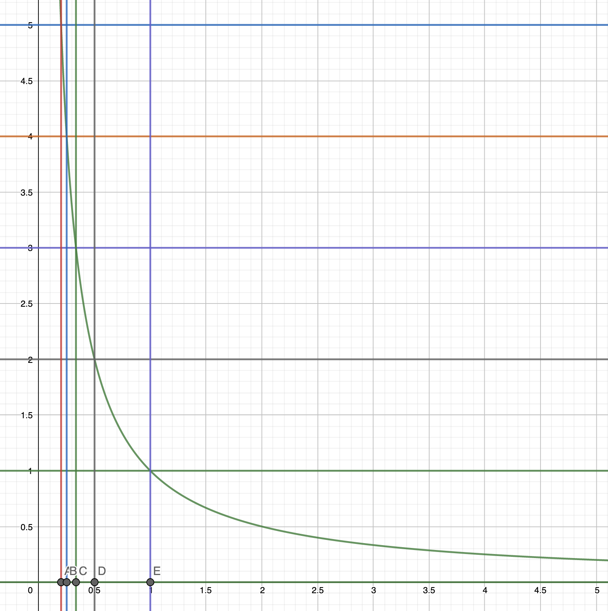

# Computer Vision Assignment 04: Model Fitting & Multi-View Stereo

## 1. File Structure

**!!! important**: Pytorch 1.10.0 is used in my assignment, please find `my_env.yaml` to create the environment. 

```
root_directory
├──Computer_Vision_Assignment4.pdf
├──images
			├── RANSAC_Plot.png
      ├── train_convergence.png
      ├── val_convergence.png
      ├── full_test_convergence.png
      ├── 3D_Plot_001.png
      └── 3D_Plot_009.png
├──codes
      ├── fitting                      
      │   └── line_fitting.py               
      └── mvs                   
          ├── my_env.yaml
          ├── checkpoints
      		│			└── model_000003.ckpt
          ├── datasets 
      		│			└── data_io.py
          └──models
      					└── module.py              

```

## 2. Model Fitting

### 2.1.3 Results


```shell
>>> python line_fitting.py
(500,)
Estimated coefficients (true, linear regression, RANSAC):
(ground truth) 									1 10 
(estimation from least-squares) 0.6159656578755457 8.96172714144364 (estimation from RANSAC)			  1.0103652266590768 9.807457331484198

```

## 3. Multi-View Stereo

### 3.2.2 Differentiable Warping

Equation of correspondence: if we assume the word coordinate is $\bf X$
$$
d_j{\bf p}= {\bf K}_0({\bf R}_0{\bf X}+{\bf t}_0) \mapsto d_j{\bf K}_0^{-1}{\bf p}= ({\bf R}_0{\bf X}+{\bf t}_0)\\
{\bf p}_{ij}= {\bf K}_i({\bf R}_{0,i}({\bf R}_0{\bf X}+{\bf t}_0) + {\bf t}_{0,i}) = {\bf K}_i(d_j{\bf R}_{0,i}{\bf K}_0^{-1}{\bf p} + {\bf t}_{0,i})\\
$$

### 3.3 Train

* Training loss


* Validatoin loss


* Full Testing


### 3.4 Test

1. Geometric consistency filtering: 

   * The function `reproject_with_depth` : calculate reprojected coordinate and depth of reference image

     * Note that we during reprojection, we use the estimated $d_{src}$ to substitute the depth from the previous calculation. 

     $$
     {\bf X}_{world} = ({\bf K}_{ref}{\bf P}_{ref})^{-1}(d_{ref}{\bf x}_{ref})\ \ where\ {\bf P}_{ref}\ is\ extrinsic\ matrix\\ 
     {\bf x}_{src} = {\bf K}_{src}{\bf P}_{src}{\bf X}_{world} \\
     {\bf x}^{reproj}_{src} =({\bf x}_{src} /{\bf x}_{src}^{(2)})d_{src}\\ 
     {\bf X}^{reproj}_{world} = ({\bf K}_{src}{\bf P}_{src})^{-1}({\bf x}^{reproj}_{src}) \\
     {\bf x}^{reproj}_{ref} = {\bf K}_{ref}{\bf P}_{ref}{\bf X}^{reproj}_{world} \\
     $$

   * The function `check_geometric_consistency`:

     * call function `reproject_with_depth` and get reprojected coordinate and depth of reference image
     * calculate the distance of coordinate and depth respectively
     * select a subset of pixels in the reference image such that the depth and pixel coordinate is reasonable (with small error). That means the pixel is well matched between the given reference image and source image. 
     * return the mask and reprojected depth values. 

   * The filtering process can filter the points that is occluded in one image but not in another image. 

     * When we average the depth values, we only consider reasonable reprojected values
     * When we reconstruct the 3D points, we only consider pixels that has not less than three reasonable matching. 

2. For all the scenes, visualize (visualize ply.py) and take screenshots of the point clouds in Open3D.

   

   

   ### 3.5 Questions

   1. In our method, we sample depth value are uniformly distributed in the range` [DEPTH MIN, DEPTH MAX]`. We can also sample depth values that are uniformly distributed in the *inverse* range `[1/DEPTH MAX, 1/DEPTH MIN]`. Which do you think is more suitable for large-scale scenes?

      

      **Answer**: I think the inverse range `[1/DEPTH MAX, 1/DEPTH MIN]` is better for large-scale scenes. Because as shown in the picture, the inverse range tends to draw more samples that closed to the minimum value. In the real-wolrd situation for large scale image, the point with high depth tends to have more uncertainty and there are more points in the image with low depth. Therefore we don’t need to sample too much large depth values 

   2. In our method, we take the average while integrating the matching similarity from several source views. Do you think it is robust to some challenging situations such as occlusions?

      **Answer**: 
      
      (1) **If we compare the result with two view (one source one reference) vision**, I think taking average has a better performance. For a pair of warpped source image and reference image, given a pixel position, depth and feature group, the similarity is fixed. If the pixel is occluded in the source image, the similarity is not valid. However, by averaging over different source images, some source images with this pixel not occluded take part in the similarity value, which improves the similarity. 
      
      (2) **If we compare the result with normal match (without occlusion situation)**, I think it is not robust enough to take the average. Because if the point on all the source image is not occluded, the similarity is the most accurate. But if there is one source view occluded, it will make the average similarity less accurate.  

