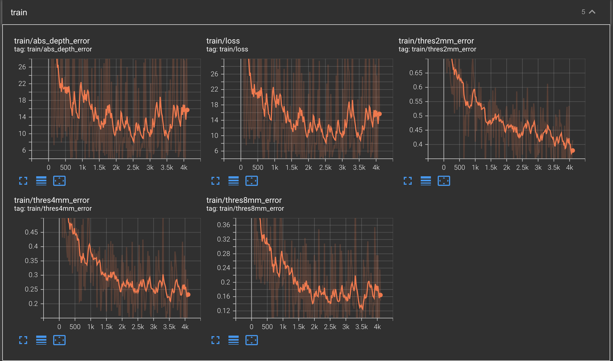

# Computer Vision Assignment 04: Model Fitting & Multi-View Stereo

## 1 File Structure

**!!! important**: Pytorch 1.10.0 is used in my assignment, please find `my_env.yaml` to create the environment. 

```
root_directory
├──Computer_Vision_Assignment4.pdf
├──images
			├── RANSAC_Plot.png
      ├── train_convergence.png
      ├── val_convergence.png
      ├── full_test_convergence.png
      ├── 3D_Plot_001.png
      └── 3D_Plot_009.png
├──codes
      ├── fitting                      
      │   └── line_fitting.py               
      └── mvs                   
          ├── my_env.yaml
          ├── checkpoints
      		│			└── model_000003.ckpt
          ├── datasets 
      		│			└── data_io.py
          └──models
      					└── module.py              

```


## 2 Model Fitting

### 2.1.3 Results


```shell
>>> python line_fitting.py
(500,)
Estimated coefficients (true, linear regression, RANSAC):
(ground truth) 									1 10 
(estimation from least-squares) 0.6159656578755457 8.96172714144364 (estimation from RANSAC)			  1.0103652266590768 9.807457331484198

```

## 3 Multi-View Stereo

### 3.2.2 Differentiable Warping

Equation of correspondence: if we assume the word coordinate is $\bf X$
$$
d_j{\bf p}= {\bf K}_0({\bf R}_0{\bf X}+{\bf t}_0) \mapsto d_j{\bf K}_0^{-1}{\bf p}= ({\bf R}_0{\bf X}+{\bf t}_0)\\
{\bf p}_{ij}= {\bf K}_i({\bf R}_{0,i}({\bf R}_0{\bf X}+{\bf t}_0) + {\bf t}_{0,i}) = {\bf K}_i(d_j{\bf R}_{0,i}{\bf K}_0^{-1}{\bf p} + {\bf t}_{0,i})\\
$$

### 3.3 Train

* Training loss



* Validatoin loss


* Full Testing


### 3.4 Test

1. 

2. For all the scenes, visualize (visualize ply.py) and take screenshots of the point clouds in Open3D.

   

   

   ### 3.5 Questions

   1. In our method, we sample depth values, , that are uniformly

   distributed in the range [DEPTH MIN, DEPTH MAX]. We can also sample depth values that are uniformly distributed in the *inverse* range [1/DEPTH MAX, 1/DEPTH MIN]. Which do you think is more suitable for large-scale scenes?

   2. In our method, we take the average while integrating the matching similarity from several source views. Do you think it is robust to some challenging situations such as occlusions?