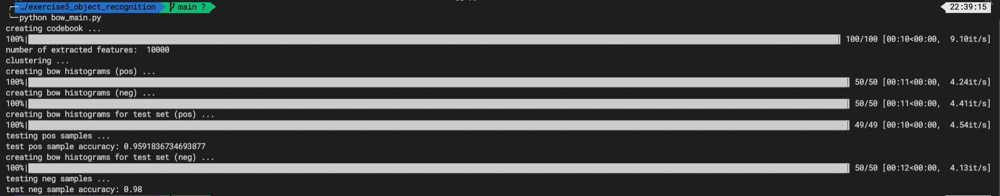
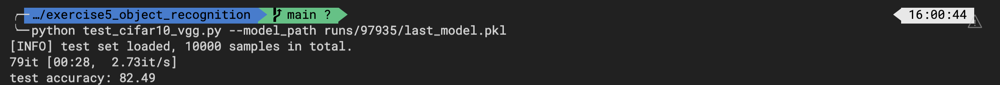

# Computer Vision Assignment 05: Object Recognition

## 1. File Structure

```
root_directory
├──Computer_Vision_Assignment5.pdf
├──runs
├──codes
      ├── bow_main.py                                
      └── models                
          └── vgg_simplified.py 
```

## 2. Bag-of-words Classifiers

### 2.1 Local Feature Extraction

#### 2.1.1 Feature detection - feature points on a grid

* Use `np.linspace` and `np.meshgrid` to generate samples
  * Notice the start point and end point should consider the border
  * The number of samples equals to `nPointsX` and `nPointsY`
* Use `np.vstack` to stack the generated grid.

#### 2.1.2 Feature description - histogram of oriented gradients

* Compute the angle by using `np.arctan2`
* For each $4 \times 4$ Cell, compute the gradient histogram by using `np.histogram` 
  * Notice the `num` parameter should be set to `nBins + 1`

----------------

### 2.2 Codebook construction

* For each image call
  * `grid_points` to generate grids
  * `descriptors_hog` to collect local features
* Concatenate all the features

------------------

### 2.3 Bag-of-words Vector Encoding

#### **2.3.1 Bag-of-Words histogram**

* Call `findnn` function to get the indices of nearest neibors for each query vector
* Calculate the histogram using `np.histogram`

#### 2.3.2 Processing a directory with training samples

* For each image call `grid_points` and `descriptors_hog` to transform it into feature
* Call `bow_histogram` to get the word frequency histogram

----------------

### 2.4 Nearest Neighbor Classification

* Use `findnn` function to calculate the minimum distances in two classes

---------------------

### 2.5 Result

* For training, I found that the hyperparameter `k=200`, `num_iter=10` results in the best accuracy `0.96` for positive class, `0.98` for negative class:



## 3. CNN-based Classifier

### 3.1. A Simplified version of VGG Network

* Convolution padding and stride size: by observation, the height and weight of the tensor divide by two for each convolution block. Therefore we choose `padding=1` for convolution and `stride=2` for max pooling. 
* Use `nn.Sequential` to stack a convolutional layer (Cone + ReLU + MaxPooling)
* Choose dropout probability to be `0.5`
* Remember to flatten the tensor in the last step in `forward` method. 

### 3.2. Training and Testing

* Training: the model is trained on GPU supported by `Google Colab`. 

  * loss of last epoch: `0.2620  `
  * accuracy of last epoch: `83.84%`
  * The loss function and validation accuracy curve is shown as below:

  

* Testing: 

  

  * The directory of the best model is `runs/97935/last_model.pkl` 
  * The testing accuracy is `82.49%`


