# Computer Vision Assignment 06: Condensation Tracker

## CONDENSATION Tracker Based On Color Histograms

### 1. Color histrogram

* I use `numpy` function `np.histogram` to extract color histogram of `R`, `G`, `B` channels (in range $(0,255)$). 
* Then concatenate three histograms using `numpy` function `np.concatenate`.
* Then normalize the histogram to make sure the values adds to one. 

### 2. Derive matrix A

#### (i) No motion at all

* If there is no motion, the position $(x,y)$ and the velocity $({\hat x}, {\hat y}) = \bf{0}$ doesn’t change. Therefore, the state transaction matrix is identity matrix:
  $$
  \bf{A} = 
    \left[ {\begin{array}{ccccc}
      1 & 0  \\
      0 & 1 \\
    \end{array} } \right]
  $$

#### (ii) Constant velocity motion model

* If the velocity is constant, the position change can be represented as:
  $$
  x_{t} = x_{t-1} + {\hat x_{t-1}}\ dt = x_{t-1} + {\hat x_{t-1}}\\\
  y_{t} = y_{t-1} + {\hat y_{t-1}}\ dt = y_{t-1} + {\hat y_{t-1}}\\
  \hat x_{t} = \hat x_{t-1},\ \hat y_{t} = \hat y_{t-1}
  $$

* Therefore, the station transaction matrix can be represented as:

$$
\bf{A} = 
  \left[ {\begin{array}{ccccc}
    1 & 0 & 1 & 0 \\
    0 & 1 & 0 & 1 \\
    0 & 0 & 1 & 0 \\
		0 & 0 & 0 & 1 \\
  \end{array} } \right]
$$

### 3. Propagation

* First we initilaize the state transaction matrix $A$ according to different motion models

* We initilaize the noise vector $\bf w$ with mean $0$ and variance $\sigma_{position}, \sigma_{velocity}$ for position and velocity respectively. This step is achieved by `np.random.normal` function.

* The we calculate next state by using the following equation:
  $$
  s^{(n)}_{t} = As^{(n)}_{t-1} + w^{(n)}_{t-1}
  $$

* Since it is possible to generate samples that is outside of the image, we check the boundary case.

### 4. Observation

* In this step, we calculate the importance of each sample that is inverse proportional to the $\chi^2$ distance between the sample box and the target box using the following equation

$$
\pi^{(n)}_{t} = {1 \over \sqrt{2 \pi}\sigma}exp(-{\chi^2(CH_{s^{(n)}_{t}}, CH_{target}) \over2\sigma^2})
$$

* For each sample, we calculate the box and check whether the box is inside the image. If not, we crop the box to make sure all pixels are in the image.
* Finally, we normalize the importance vector to make sure it adds to one.

### 5. Estimation

* Given the importance vector $\pi$ and the states matrix $S$, we can calculate the mean state (which is the convex combination of the row vectors of $S$):

$$
\bar S = (S^T\pi)^T
$$

### 6. Resampling

* For weighted resampling, I use the `numpy` function `np.random.choice` to sample the index

## Experiments

### 1. *video1.wmv*

Baseline: model: 0, sigma_observe: 0.1, sigma_position: 15

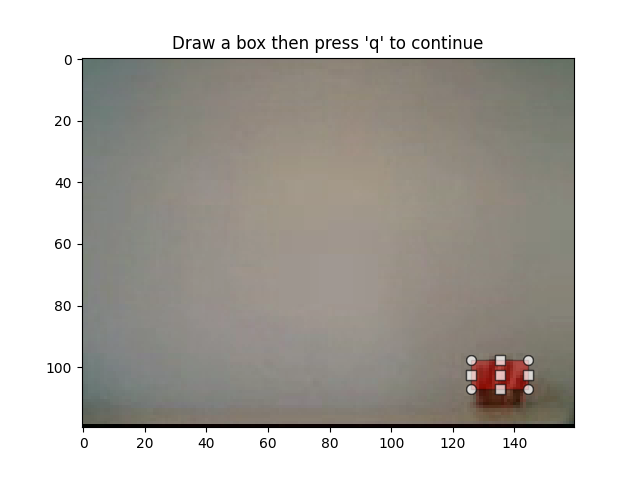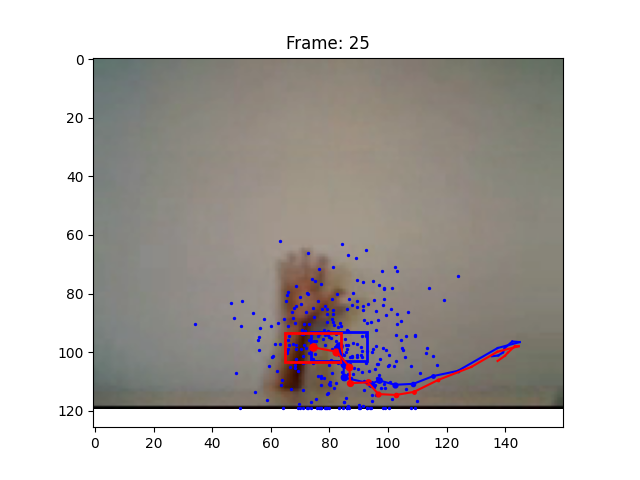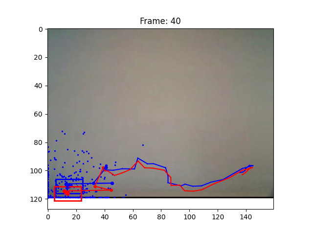

* As shown in the frame 0, 25, 40. The algorithm can track the object roughly. However, the box moves from the finger to the wrist. 
* This is the limitation of the color histogram, because it only consider the color and don’t consider the contextual information

### 2. *video2.wmv*

Baseline: model: 0, sigma_observe: 0.1, sigma_position: 15

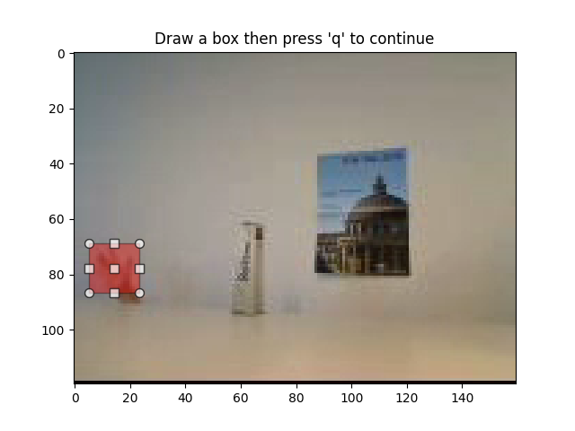 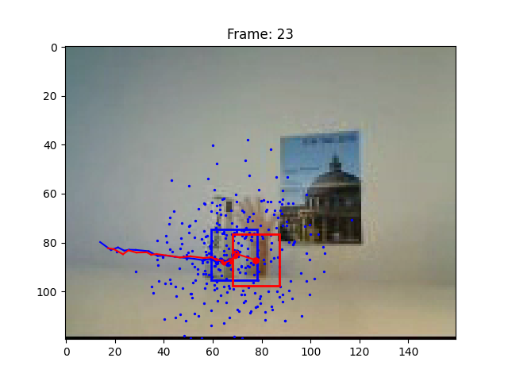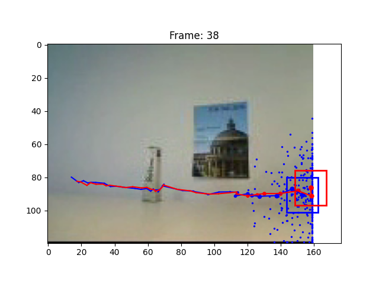

* Effect of assuming system noise: If we change the sigma_position to 1, the generated samples are distributed more compact. And when occlusion happens, the tracker cannot track the hand properly. 

  * Decrease: samples are more compact
  * Increase: samples are more sparse

  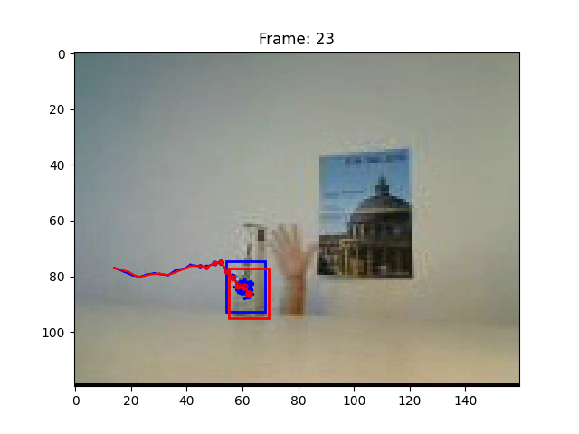

* Effect of constant velocity motion model: If we keep the sigma_position as a small value (1), and change the model to constant velocity motion model with initial velocity (5,0) since the motion is only on the $x$ direction. We can find that although some of the samples are stuck to the occlusion object, most of the samples can track the hand correctly. 

  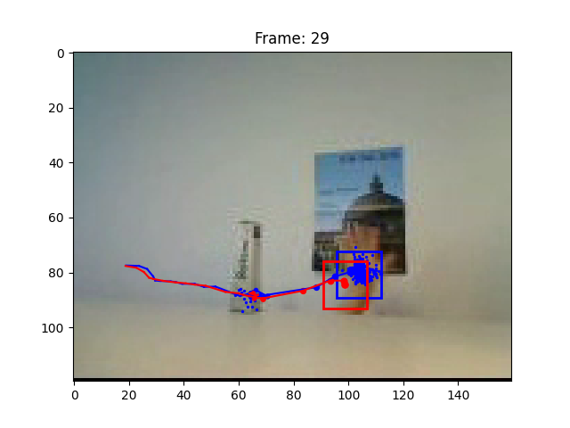

* Effect of measurement noise:

  * Increase: The samples are more sparse, and the irrelavent samples are often reserved. Therefore, tracking fails. (sigma_observe = 0.5)

    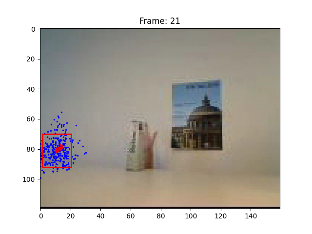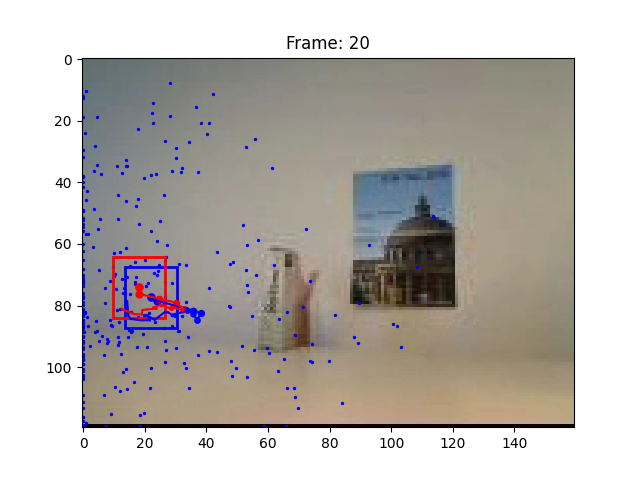

  * Decrease: The samples are more compact. 

### 3. *video3.wmv*

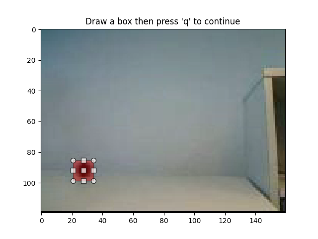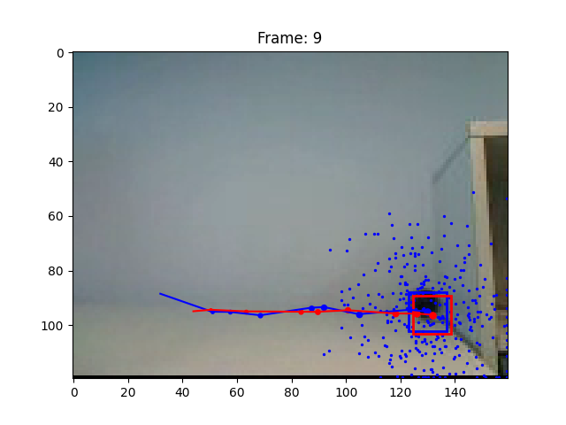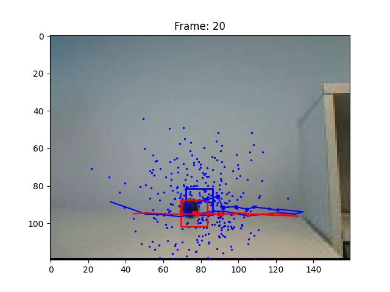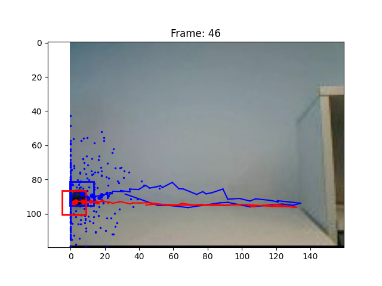

* If I set the sigma_position to a small value, the algorithm cannot track the ball because the speed of the ball is too high. Therefore, I increase the sigma_position to make the algorithm track the ball more efficiently.

* Parameters:

  ```
  params = {
  	"draw_plots": 1,
  	"hist_bin": 16,
  	"alpha": 0.5,
  	"sigma_observe": 0.1,
  	"model": 1,
  	"num_particles": 300,
  	"sigma_position": 15,
  	"sigma_velocity": 1,
  	"initial_velocity": (5, 0)
  }
  ```

### 4. Effect of sample size and bin size

* When I increase the sample size (number of particles), the algorithm becomes more accurate but the computation time is longer. While if I decrease the sample size, the algorithm becomes less robust. 
* A larger bin size also makes the model more accurate. However, for the tracking problem with low illumination change, the different bin size will not affect the result that much. And for the tracking problem with occlusion and illumination change, the different bin size will have more effect.

### 6. Effect of appearance model updating

* In the *video1.wmv*,  the box moves from the finger to the wrist due to the illumination changement. If we increase alpha (the weight of new state), the performance is better. This is because the appearance model updating make the algorithm more robust to changes in the environment.
